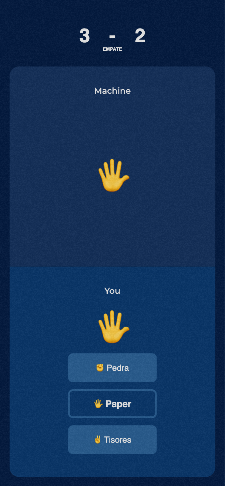

# Piedra, papel o tijera

Es un juego de manos en el que existen tres elementos: 

- La piedra, que vence a la tijera rompiéndola.
- La tijera, que vence al papel cortándolo.
- El papel, que vence a la piedra envolviéndola.

Se utiliza con mucha frecuencia para decidir quién de dos personas hará algo, tal y como se hace a veces usando una moneda, o para dirimir algún asunto.

## Tabla de contenidos

- [Demostración en vivo](#demostración-en-vivo)
- [Características](#características)
- [Tecnologías utilizadas](#tecnologías-utilizadas)
- [Vista previa del proyecto](#vista-previa-del-proyecto)
- [Instalación](#instalación)
- [Autor](#Autor)

## Demostración en vivo

Puedes ver una demostración en vivo del proyecto [aquí](https://tu-url-de-demo.com).

## Características

- Interfaz de usuario intuitiva y fácil de usar.
- Marcador y puntuación.
- Manejo de elementos del DOM.
- Compatibilidad con dispositivos móviles.

## Tecnologías utilizadas

- HTML5
- CSS3
- JavaScript

## Vista previa del proyecto

## Instalación
Este proyecto no necesita de instalación. Abre la carpeta o haz doble click en el .html

## Autor
**Alberto Garsan (@albertogarsan)**
- [Email](mailto:albertogarsan@outlook.com)
- [Linkedin](https://www.linkedin.com/albertogarciasan)
- [Website](https://www.albertogarsan.com/)

